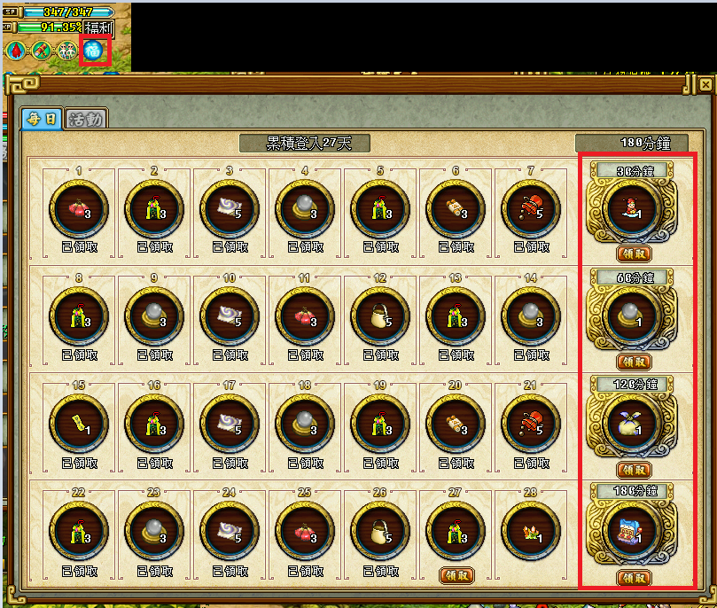
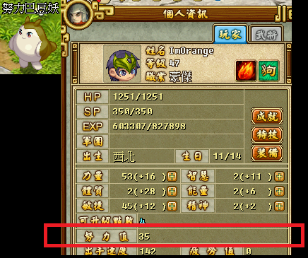
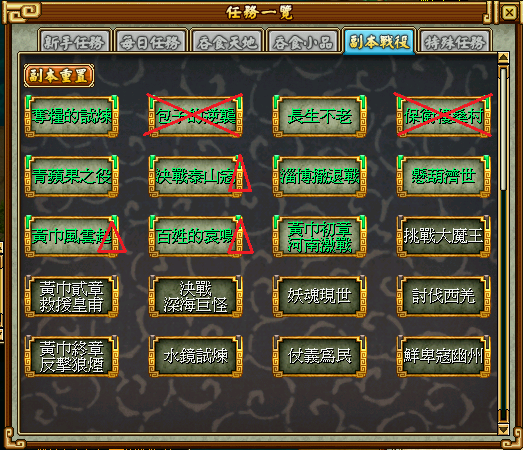
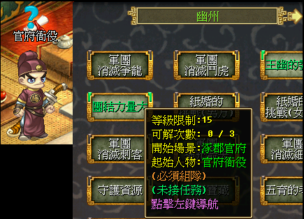
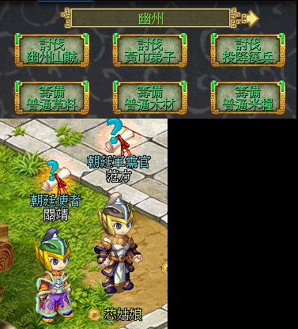

# 特別獎勵
1. [連線獎勵](#connectionReward)
1. [福利巴豆妖問答 (可拿五株，每天一次)](#welfareBaDouYao)
1. [努力巴豆妖 (每連線1小時就會增加1點努力值，上限100，建議80 90的時候就可以換了)](#effortBaDouYao)
1. 節慶or生日巴豆妖 (就...對應節日或生日時會送獎勵，反正那幾隻都聚在一起不多做說明了)

# ====================================
*   ## 連線獎勵
     

# ====================================
*   ## 福利巴豆妖問答 (可拿五株，每天一次)
      

*   ## 努力巴豆妖 (每連線1小時就會增加1點努力值，上限100，建議80 90的時候就可以換了)
      
# ====================================

# 經驗和武點來源
1. [副本 (一天五次，少數副本除外，拿小布包或裝備用的)](#dungeon)
1. [官府任務 (需組隊，每個地區一天三次)](#government)
1. [討伐任務 (打怪物100隻，又稱百人)](#daily100andItem)
1. [籌備任務 (打任務道具，又稱軍需)](#daily100andItem)

*   ## 副本
    ### 說明：主要是打小布包和裝備用的，打叉的是幾乎沒人打，前面10~20等 (奪糧、包逆、蘋果) 可打可不打，因為裝備很快就汰換掉了
    ### 各副本說明：
    ### 奪糧的試煉(Lv10)：奪糧、9包 (9包由來是一場最多可以拿9個土黃布包)
    ### 包子的逆襲(Lv10)：包逆
    ### 長生不老(Lv10)：
    ### 保衛樓桑村(Lv20)：保衛村長、村長 (村長真的有夠爛)
    ### 青蘋果之役(Lv20)：青蘋果、蘋果
    ### 決戰泰山寇(Lv30)：泰山
    ### 淄博撤退戰(Lv30)：撤退
    ### 懸壺濟世(Lv40)：葫蘆
    ### 黃金風雲起(Lv40)：40黃巾
    ### 百姓的哀鳴(Lv45)：百姓
    ### 黃巾初章河南激戰(Lv45)：45黃巾、河南激戰
     

# ====================================
*   ## 官府
    ### 說明：需組隊，開放等級是15、25、35....以此類推
    ### 喊話範例：15~35 官府
    ### 對應NPC：如下圖
     

# ==================================== #
*   ## 討伐和籌備
    ### 說明：不打暗怪，只挑打近1~2個等級帶的，像是4X等就打40 + 30
    ### 討伐：又稱百人，建議組滿人一起打，人越多怪也會越多
    ### 籌備：又稱軍需
     